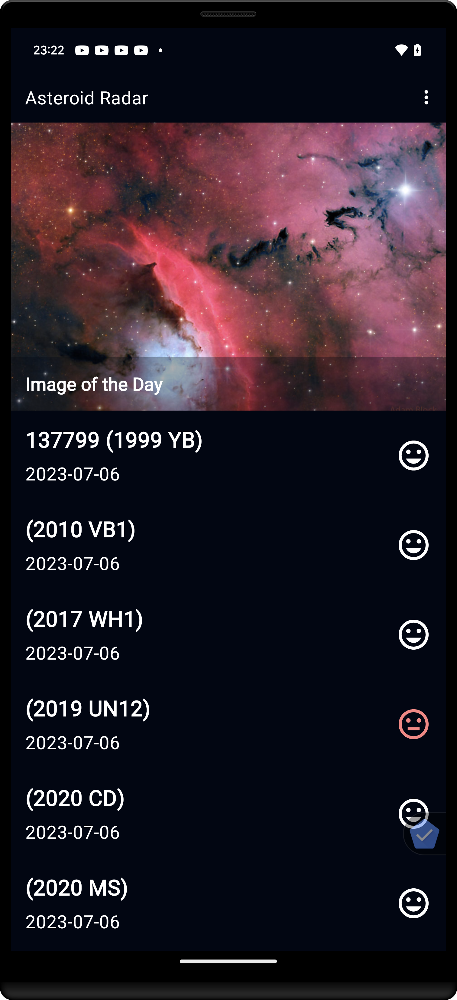
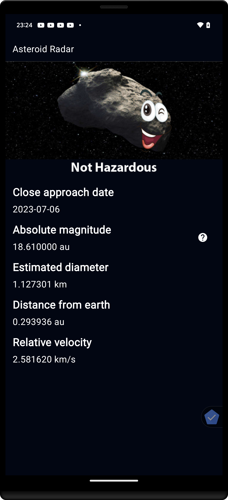
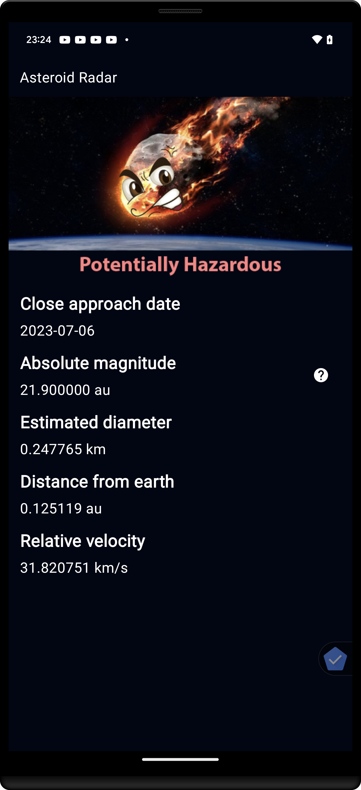

# Asteroid Radar

Asteroid Radar is an app to view the asteroids detected by NASA that pass near Earth, 
you can view all the detected asteroids given a period of time with data such as the size, 
velocity, distance to earth and if they are potentially hazardous. To this end, the NEoWs API, which 
is a free, open source API provided by NASA JPL Asteroid team, is used.

The resulting output of the project will be two screens: a Main screen with a list of all the 
detected asteroids and a Details screen that displays the data of that asteroid once it´s selected 
in the Main screen list. The main screen will also show the NASA image of the day.

## Key Libraries

Material
Navigation Component
Timber
Picasso
Retrofit
Moshi
Room
OkHttp
WorkManager

## Screenshots

 

